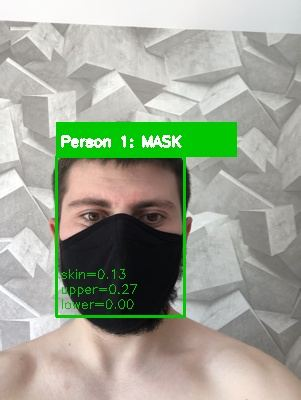
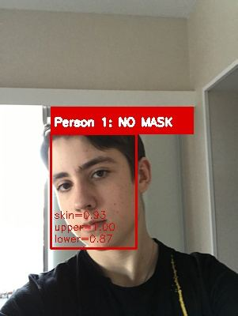
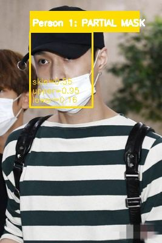
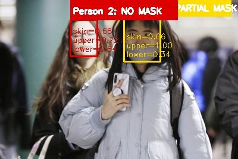

# Face Region Analysis — Face Mask Detection

Computer Vision team project — **Theme 15: Face Region Analysis**.

A classical computer vision pipeline that detects faces in an image and classifies each one as **MASK**, **PARTIAL MASK**, **NO MASK**, or reports **FACE NOT DETECTED**. The system supports multiple people per image and produces stage-by-stage visual outputs.

---

## Pipeline

```
image  →  enhance  →  segment  →  clean  →  detect  →  decide
```

| Stage | Module | What it does |
|-------|--------|--------------|
| 1. Enhance | [enhance.py](enhance.py) | CLAHE contrast boost, non-local-means denoising, gamma correction |
| 2. Segment | [segment.py](segment.py) | DNN SSD face detector with Haar Cascade fallback, ROI extraction |
| 3. Clean | [clean.py](clean.py) | HSV + YCrCb skin masks, morphological opening / closing |
| 4. Detect | [detect.py](detect.py) | Skin / non-skin ratios for the upper and lower face halves |
| 5. Decide | [decide.py](decide.py) | Rule-based classifier into MASK / PARTIAL MASK / NO MASK |

Shared constants and tunable thresholds live in [config.py](config.py). Image output is handled by [visualize.py](visualize.py). The entry point is [main.py](main.py).

---

## Installation

Requires Python 3.10+.

```bash
python -m pip install -r requirements.txt
```

For the higher-accuracy DNN detector, place the following files in the project root (otherwise the pipeline falls back to Haar Cascade automatically):

- `deploy.prototxt`
- `res10_300x300_ssd_iter_140000.caffemodel`

---

## Usage

```bash
python main.py photo.jpg
python main.py image1.jpg image2.png image3.jpg
```

For every input image the pipeline writes five files to `./output/`:

- `<name>_1_original.jpg`
- `<name>_2_enhanced.jpg`
- `<name>_3_segmentation.jpg`
- `<name>_4_cleaned.jpg`
- `<name>_5_detection.jpg` — final image with bounding boxes and labels

A summary with per-person labels is printed to the console.

---

## Results

| MASK | NO MASK |
|------|---------|
|  |  |

| PARTIAL MASK | Multi-person |
|--------------|--------------|
|  |  |

Bounding box color codes the decision: **green** = MASK, **red** = NO MASK, **yellow** = PARTIAL MASK.

---

## Project structure

```
.
├── main.py               # CLI entry point + run_pipeline()
├── config.py             # All thresholds, color ranges, paths
├── enhance.py            # Stage 1
├── segment.py            # Stage 2
├── clean.py              # Stage 3
├── detect.py             # Stage 4
├── decide.py             # Stage 5
├── visualize.py          # Output image rendering
├── report.md             # Full team report
├── report_images/        # Result screenshots used in the report
├── requirements.txt
└── CV_Team_Project_Brief.docx
```

---

## Full report

The complete team report — abstract, methods, experimental results, limitations, and conclusions — is in [report.md](report.md).
